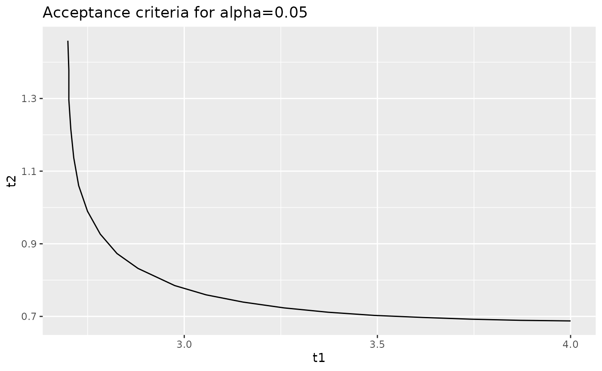
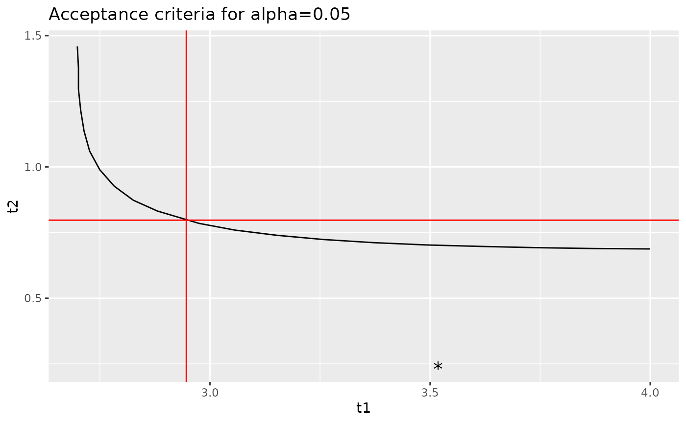
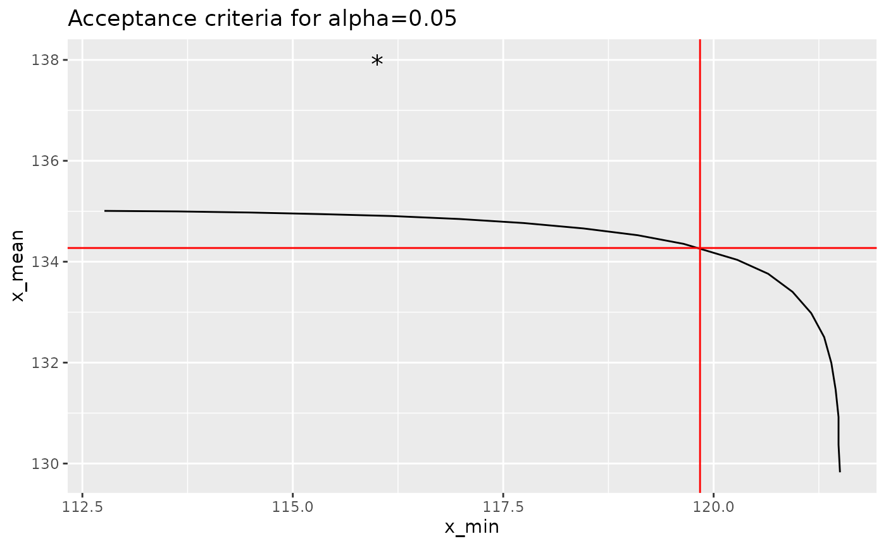

# p-Values for Equivalency

## Introduction

The dual acceptance criteria used for composite materials accept or
reject a new lot of material (or a process change) based on the sample
minimum and sample mean from the new lot of material. Acceptance limits
are normally set such that under the null hypothesis, there is an equal
probability of rejecting the lot due to the minimum and rejecting the
lot due to the mean. These acceptance limits are set so that the
probability of rejecting the lot (due to *either* the minimum or mean)
under the null hypothesis is $\alpha$. If we eliminate the constraint
that there is an equal probability of rejecting a lot due to the minimum
or the mean, there is not longer unique values for the acceptance
limits: instead, we can calculate a p-value from the sample minimum and
the sample mean and compare this p-value with the selected value of
$\alpha$.

The `cmstatrExt` package provides functions for computing acceptance
limits, p-values and curves indicating all values of the minimum and
mean that result in the same p-value. This vignette demonstrates this
functionality. The “two-sample” method in which only the sample
statistics for the qualification data are known.

**Caution:** If the true mean of the population from which the
acceptance sample is drawn is higher than the population mean for the
qualification distribution, then using the p-value method here may
declare an acceptance sample as equivalent even if the standard
deviation is larger. This is due to the fact that this statistical test
is a one-sided test. Similarly, if the acceptance population has a much
lower standard deviation than the qualification population, this test
may allow for an undesirable decrease in mean. As such, considerable
judgement is required when using this method.

In this vignette, we’ll use the `cmstatrExt` package. We’ll also use the
`tidyverse` package for data manipulation and graphing. Finally, we’ll
use one of the example data sets from the `cmstatr` package.

``` r
library(cmstatrExt)
library(tidyverse)
library(cmstatr)
```

## Example Data

As an example, we’ll use the RTD warp tension strength from the
`carbon.fabric.2` example data set from the `cmstatr` package. This data
is as follows:

``` r
dat <- carbon.fabric.2 %>%
  filter(condition == "RTD" & test == "WT")
dat
#>    test condition batch panel thickness nplies strength modulus failure_mode
#> 1    WT       RTD     A     1     0.113     14  129.224   8.733          LAB
#> 2    WT       RTD     A     1     0.112     14  144.702   8.934      LAT,LWB
#> 3    WT       RTD     A     1     0.113     14  137.194   8.896          LAB
#> 4    WT       RTD     A     1     0.113     14  139.728   8.835      LAT,LWB
#> 5    WT       RTD     A     2     0.113     14  127.286   9.220          LAB
#> 6    WT       RTD     A     2     0.111     14  129.261   9.463          LAT
#> 7    WT       RTD     A     2     0.112     14  130.031   9.348          LAB
#> 8    WT       RTD     B     1     0.111     14  140.038   9.244      LAT,LGM
#> 9    WT       RTD     B     1     0.111     14  132.880   9.267          LWT
#> 10   WT       RTD     B     1     0.113     14  132.104   9.198          LAT
#> 11   WT       RTD     B     2     0.114     14  137.618   9.179      LAT,LAB
#> 12   WT       RTD     B     2     0.113     14  139.217   9.123          LAB
#> 13   WT       RTD     B     2     0.113     14  134.912   9.116          LAT
#> 14   WT       RTD     B     2     0.111     14  141.558   9.434    LAB / LAT
#> 15   WT       RTD     C     1     0.108     14  150.242   9.451          LAB
#> 16   WT       RTD     C     1     0.109     14  147.053   9.391          LGM
#> 17   WT       RTD     C     1     0.111     14  145.001   9.318      LAT,LWB
#> 18   WT       RTD     C     1     0.113     14  135.686   8.991    LAT / LAB
#> 19   WT       RTD     C     1     0.112     14  136.075   9.221          LAB
#> 20   WT       RTD     C     2     0.114     14  143.738   8.803      LAT,LGM
#> 21   WT       RTD     C     2     0.113     14  143.715   8.893      LAT,LAB
#> 22   WT       RTD     C     2     0.113     14  147.981   8.974      LGM,LWB
#> 23   WT       RTD     C     2     0.112     14  148.418   9.118      LAT,LWB
#> 24   WT       RTD     C     2     0.113     14  135.435   9.217      LAT/LAB
#> 25   WT       RTD     C     2     0.113     14  146.285   8.920      LWT/LWB
#> 26   WT       RTD     C     2     0.111     14  139.078   9.015          LAT
#> 27   WT       RTD     C     2     0.112     14  146.825   9.036      LAT/LWT
#> 28   WT       RTD     C     2     0.110     14  148.235   9.336      LWB/LAB
```

From this sample, we can calculate the following summary statistics for
the strength:

``` r
qual <- dat %>%
  summarise(n = n(), mean = mean(strength), sd = sd(strength))
qual
#>    n     mean       sd
#> 1 28 139.6257 6.716047
```

## Acceptance Limits

We can calculate the acceptance factors acceptance sample size of 8 and
$alpha = 0.05$ using the `cmstatrExt` package as follows:

``` r
k <- k_equiv_two_sample(0.05, qual$n, 8)
k
#> [1] 2.9462891 0.7972005
```

These factors can be transformed into limits using the following
equations:

\$\$ W\_{indiv} = \bar{x}\_{qual} - k_1 s\_{qual} \\ W\_{mean} =
\bar{x}\_{qual} - k_2 s\_{qual} \$\$

Implementing this in R:

``` r
acceptance_limits <- qual$mean - k * qual$sd
acceptance_limits
#> [1] 119.8383 134.2717
```

So, if an acceptance sample has a minimum individual less than 119.8 or
a mean less than 134.3, we would reject it.

## p-Value

You might ask what happens if there’s one low value in the acceptance
sample that’s below the acceptance limit for minimum individual, but the
mean is well above the limit. The naive response would be to reject the
sample. But, the acceptance limits that we just calculated are based on
setting an equal probability of rejecting a sample based on the minimum
and the mean under the null hypothesis — there are other pairs of
minimum and mean values that have the same p-value as the acceptance
limits that we calculated.

In order to use the p-value function from the `cmstatrExt` package, we
need to apply the following transformation:

\$\$ t_1 = \frac{\bar{x}\_{qual} - x\_{acceptance\\(1)}}{s\_{qual}} \\
t_2 = \frac{\bar{x}\_{qual} - \bar{x}\_{acceptance}}{s\_{qual}} \$\$

As a demonstration, let’s first calculate the p-value of the acceptance
limits. We should get $p = \alpha$.

``` r
p_equiv_two_sample(
  n = qual$n,
  m = 8,
  t1 = (qual$mean - acceptance_limits[1]) / qual$sd,
  t2 = (qual$mean - acceptance_limits[2]) / qual$sd
)
#> [1] 0.05003139
```

This value is very close to $\alpha = 0.05$ — within expected numeric
precision.

Now, let’s consider the case where the sample minimum is 116 and the
mean is 138. The sample minimum is below the acceptance limit (116 \<
120), but the sample mean is well above the acceptance limit (138 \>
134). Let’s calculate the p-value for this case:

``` r
p_equiv_two_sample(
  n = qual$n,
  m = 8,
  t1 = (qual$mean - 116) / qual$sd,
  t2 = (qual$mean - 138) / qual$sd
)
#> [1] 0.2771053
```

Since this value is well above the selected value of $\alpha = 0.05$, we
would accept this sample. This sort of analysis can be useful during
site- or process-equivalency programs, or for MRB activities.

## Curves of Constant p-Values

The `cmstatrExt` package provides a function that produces a
`data.frame` containing values of $t_{1}$ and $t_{2}$ that result in the
same p-value. We can create such a `data.frame` for p-values of 0.05 as
follows:

``` r
curve <- iso_equiv_two_sample(qual$n, 8, 0.05, 4, 1.5, 10)
curve
#>          t1        t2
#> 1  4.000000 0.6876226
#> 2  3.870890 0.6892186
#> 3  3.742796 0.6924106
#> 4  3.616481 0.6971987
#> 5  3.492200 0.7027848
#> 6  3.372239 0.7115630
#> 7  3.258124 0.7235332
#> 8  3.152269 0.7394934
#> 9  3.056580 0.7594437
#> 10 2.975250 0.7849802
#> 11 2.880451 0.8321028
#> 12 2.825808 0.8732404
#> 13 2.782601 0.9266275
#> 14 2.749561 0.9895908
#> 15 2.726687 1.0602149
#> 16 2.713980 1.1365848
#> 17 2.706355 1.2156679
#> 18 2.701272 1.2961076
#> 19 2.701272 1.3776646
#> 20 2.698730 1.4591417
```

We can plot this curve using `ggplot2`, which is part of the `tidyverse`
package:

``` r
curve %>%
  ggplot(aes(x = t1, y = t2)) +
  geom_path() +
  ggtitle("Acceptance criteria for alpha=0.05")
```



When you plot this, make sure to use `geom_path` and not `geom_line`.
The former will plot the points in the order given; the latter will plot
the points in ascending order of the `x` variable, which can cause
problems in the vertical portion of the graph.

Let’s overlay the acceptance limits calculated by the
`k_equiv_two_sample` function as well as the values of `t_1` and `t_2`
from the sample that we discussed in the previous section.

``` r
curve %>%
  ggplot(aes(x = t1, y = t2)) +
  geom_path() +
  geom_hline(yintercept = k[2], color = "red") +
  geom_vline(xintercept = k[1], color = "red") +
  geom_point(data = data.frame(
    t1 = (qual$mean - 116) / qual$sd,
    t2 = (qual$mean - 138) / qual$sd
  ),
  shape = "*", size = 5) +
  ggtitle("Acceptance criteria for alpha=0.05")
```



Or better yet, we can transform this back into engineering units:

``` r
curve %>%
  mutate(x_min = qual$mean - t1 * qual$sd,
         x_mean = qual$mean - t2 * qual$sd) %>%
  ggplot(aes(x = x_min, y = x_mean)) +
  geom_path() +
  geom_hline(yintercept = acceptance_limits[2], color = "red") +
  geom_vline(xintercept = acceptance_limits[1], color = "red") +
  geom_point(data = data.frame(
    x_min = 116,
    x_mean = 138
  ),
  shape = "*", size = 5) +
  ggtitle("Acceptance criteria for alpha=0.05")
```


