# Stress-Strain Curves

This vignette demonstrates generation of averaged stress-strain curves
from data from several coupons. The same procedure can be used to
generate bearing load-deformation curves and other similar curves.

There are two functions provided by the `cmstatrExt` package for doing
this. The function
[`average_curve_lm()`](https://cmstatrExt.cmstatr.net/reference/average_curve_lm.md)
uses [`stats::lm()`](https://rdrr.io/r/stats/lm.html) behind the scenes
to fit a curve defined by a `formula` to the data. The function
[`average_curve_optim()`](https://cmstatrExt.cmstatr.net/reference/average_curve_optim.md)
uses numeric optimization to fit a curve defined by a user-specified
function to the data. Use the former function for fitting polynomials,
use the latter for fitting exponential models or models with
discontinuities. Both will be discussed in more detail in this vignette.

## Setup

In this example, the following packages need to be loaded:

``` r
knitr::opts_chunk$set(message = FALSE, warning = FALSE)
library(cmstatrExt)
library(tidyverse)
#> ── Attaching core tidyverse packages ──────────────────────── tidyverse 2.0.0 ──
#> ✔ dplyr     1.2.0     ✔ readr     2.2.0
#> ✔ forcats   1.0.1     ✔ stringr   1.6.0
#> ✔ ggplot2   4.0.2     ✔ tibble    3.3.1
#> ✔ lubridate 1.9.5     ✔ tidyr     1.3.2
#> ✔ purrr     1.2.1     
#> ── Conflicts ────────────────────────────────────────── tidyverse_conflicts() ──
#> ✖ dplyr::filter() masks stats::filter()
#> ✖ dplyr::lag()    masks stats::lag()
#> ℹ Use the conflicted package (<http://conflicted.r-lib.org/>) to force all conflicts to become errors
```

## Example Data

The `cmstatrExt` package comes with some example stress-strain data. The
first few rows of this data are:

``` r
head(pa12_tension)
#> # A tibble: 6 × 3
#>   Coupon     Strain Stress
#>   <chr>       <dbl>  <dbl>
#> 1 Coupon 4 0        0.0561
#> 2 Coupon 4 0.000200 0.247 
#> 3 Coupon 4 0.000400 0.569 
#> 4 Coupon 4 0.000601 0.440 
#> 5 Coupon 4 0.000801 0.778 
#> 6 Coupon 4 0.00100  0.854
```

This data is in “tidy” format. This means that each data-point
(stress-strain value) is in a row of the `data.frame`. This example data
set contains stress-strain data from four coupons (Samples 1 through 4).
Each row identifies the coupon that the observation comes from. While
the order of the columns does not matter and you can give each column
any name you wish, the data will need to be in this type of format.

Let’s plot the `pa12_tension` example data.

``` r
pa12_tension %>%
  ggplot(aes(x = Strain, y = Stress, color = Coupon)) +
  geom_point()
```

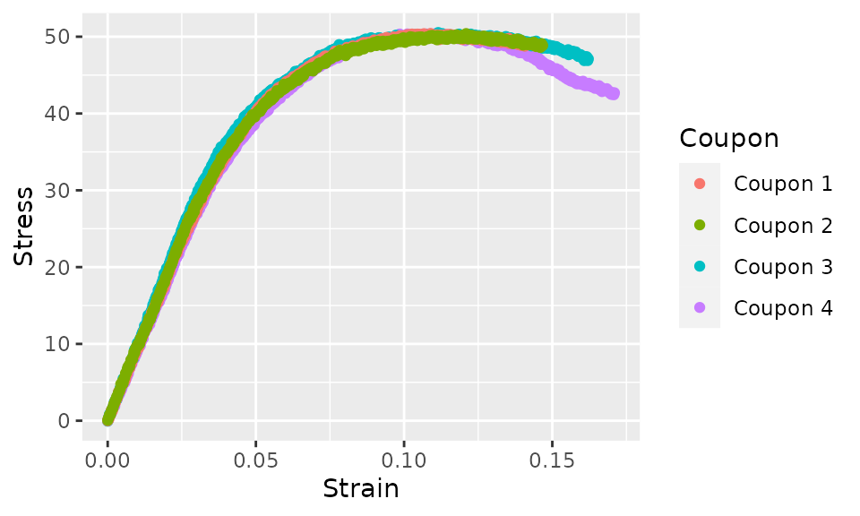

## Fitting a Polynomial Model

For the first example, we’ll fit the following quadratic model:

$$\sigma = c_{1}\epsilon + c_{2}\epsilon^{2}$$ where $\sigma$ is the
stress, $\epsilon$ is the strain and $c_{1}$ and $c_{2}$ are constants
that we’ll find. We need to write this as an `R` `formula`, which has
slightly different notation. The stress and strain variables in our data
are `Stress` and `Strain`, respectively, so we’ll use those variable
names in the formula.

``` r
Stress ~ I(Strain) + I(Strain^2) + 0
```

Notice that in this formula, a tilde (`~`) is used instead of an equal
sign. You’ll also notice that we’ve wrapped the terms on the right-hand
side inside the identity function
[`I()`](https://rdrr.io/r/base/AsIs.html): the reason for this is that
`lm` will treat `Strain^2` as an interaction, rather than squaring the
value of `Strain`, while `I(Strain^2)` will actually square the value of
`Strain`. The formula doesn’t need coefficients (e.g. $c_{1}$ and
$c_{2}$). Finally, notice that we’ve included the term `+0`, which tells
`lm` that we want the intercept to be zero, which will normally be
desirable due to the physical notion that stress ought to be zero at
zero strain.

The function `average_curve_lm` takes four arguments. The first is a
`data.frame` with the data. The second is the name of the variable
defining the coupon. The third is the formula that we just discussed.
The last argument is the number of “bins”: this has a default of 100 and
hence can be omitted. See the documentation for this function for
information about binning the data.

Let’s run this function and then execute the `summary` method on the
result:

``` r
curve_quadratic <- average_curve_lm(
  pa12_tension, Coupon,
  Stress ~ I(Strain) + I(Strain^2) + 0
)
summary(curve_quadratic)
#> 
#> Range: ` Strain ` in  [0,  0.1409409 ]
#> n_bins =  100
#> 
#> Call:
#> average_curve_lm(data = pa12_tension, coupon_var = Coupon, model = Stress ~ 
#>     I(Strain) + I(Strain^2) + 0)
#> 
#> Residuals:
#>     Min      1Q  Median      3Q     Max 
#> -2.3812 -1.1354  0.0107  1.4057  4.2013 
#> 
#> Coefficients:
#>              Estimate Std. Error t value Pr(>|t|)    
#> I(Strain)    1010.585      4.016   251.6   <2e-16 ***
#> I(Strain^2) -4913.506     36.786  -133.6   <2e-16 ***
#> ---
#> Signif. codes:  0 '***' 0.001 '**' 0.01 '*' 0.05 '.' 0.1 ' ' 1
#> 
#> Residual standard error: 1.626 on 398 degrees of freedom
#> Multiple R-squared:  0.9985, Adjusted R-squared:  0.9984 
#> F-statistic: 1.286e+05 on 2 and 398 DF,  p-value: < 2.2e-16
```

The `summary` method shows the strain range over which the curve was
fit. This range always starts at zero and ends at the *lowest* maximum
strain of any individual coupon. The `summary` method also lists the
coefficients as well as information about whether each term is
statistically significant, the residuals and R-squared values.

Next, let’s plot the original data and the curve fit. We’ll use the
`augment` method to add the curve fit to the original data, then pass
the result to `ggplot`.

``` r
curve_quadratic %>%
  augment() %>%
  ggplot(aes(x = Strain)) +
  geom_point(aes(y = Stress, color = Coupon)) +
  geom_line(aes(y = .fit))
```

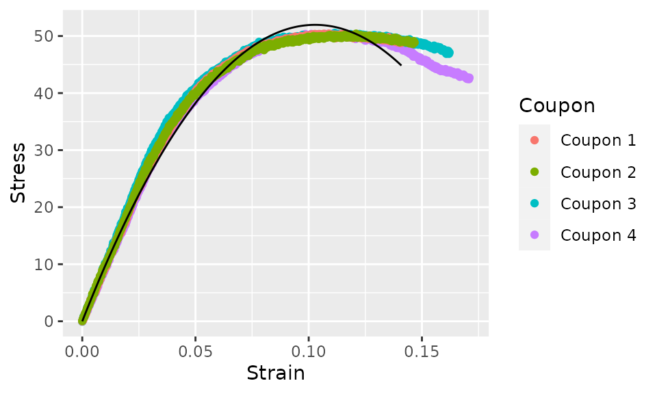

Due to the polynomial model that we chose (quadratic), this curve fit is
poor. We can do better. Let’s try a cubic function next.

``` r
curve_cubic <- average_curve_lm(
  pa12_tension, Coupon,
  Stress ~ I(Strain) + I(Strain^2) + I(Strain^3) + 0
)
summary(curve_cubic)
#> 
#> Range: ` Strain ` in  [0,  0.1409409 ]
#> n_bins =  100
#> 
#> Call:
#> average_curve_lm(data = pa12_tension, coupon_var = Coupon, model = Stress ~ 
#>     I(Strain) + I(Strain^2) + I(Strain^3) + 0)
#> 
#> Residuals:
#>     Min      1Q  Median      3Q     Max 
#> -2.3080 -0.4003 -0.1726  0.3103  2.2058 
#> 
#> Coefficients:
#>              Estimate Std. Error t value Pr(>|t|)    
#> I(Strain)    1173.285      4.662  251.69   <2e-16 ***
#> I(Strain^2) -8761.916    102.493  -85.49   <2e-16 ***
#> I(Strain^3) 20480.874    537.832   38.08   <2e-16 ***
#> ---
#> Signif. codes:  0 '***' 0.001 '**' 0.01 '*' 0.05 '.' 0.1 ' ' 1
#> 
#> Residual standard error: 0.7546 on 397 degrees of freedom
#> Multiple R-squared:  0.9997, Adjusted R-squared:  0.9997 
#> F-statistic: 3.985e+05 on 3 and 397 DF,  p-value: < 2.2e-16
```

``` r
curve_cubic %>%
  augment() %>%
  ggplot(aes(x = Strain)) +
  geom_point(aes(y = Stress, color = Coupon)) +
  geom_line(aes(y = .fit))
```

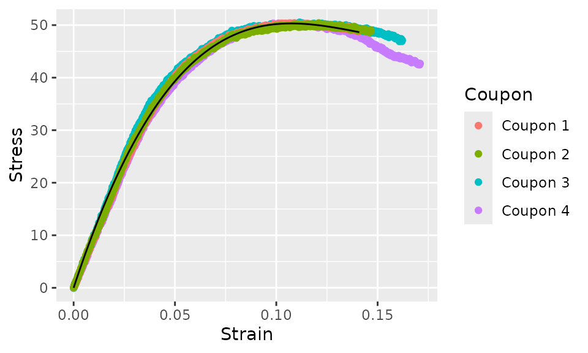

This cubic model is a much better fit. The equation for this curve fit
is:

$$\sigma = 1174\,\epsilon - 8783\,\epsilon^{2} + 20586\,\epsilon^{3}$$

Strain does not need to be the independent variable and stress does not
need to be the dependent variable. We could fit a model with these
reversed.

``` r
average_curve_lm(
  pa12_tension, Coupon,
  Strain ~ I(Stress) + I(Stress^2) + I(Stress^3) + I(Stress^4) + 0
) %>%
  augment() %>%
  ggplot(aes(y = Stress)) +
  geom_point(aes(x = Strain, color = Coupon)) +
  geom_line(aes(x = .fit))
```

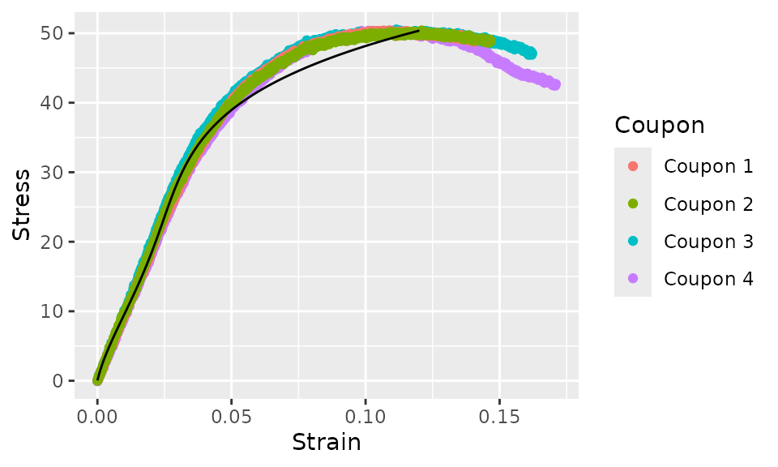

In this case, the fit is not very good, so it’s not of much practical
use. However, note that the curve fit ends at the lowest maximum
*stress* value of any individual coupon this time. The curve fit will
always end at the lowest maximum value of the independent variable (the
variable on the right hand side of the formula).

## Fitting a Bilinear Model

Next, we turn our attention to fitting a model that cannot be
represented by an `R` `formula`. We’ll fit the following model:

$$\sigma = \left\{ \begin{matrix}
{c_{1}\epsilon} & {{\text{if}\mspace{6mu}}\epsilon \leq \epsilon_{1}} \\
{c_{2}\left( \epsilon - \epsilon_{1} \right) + c_{1}\epsilon_{1}} & \text{otherwise}
\end{matrix} \right.$$

This model will thus be a straight line starting from the origin
extending to an unknown value of strain ($\epsilon_{1}$), then
continuing with a different slope. In order to use this model with
`average_curve_optim`, we need to write this as an `R` function where
the first argument is the independent variable (strain in our case) and
the second argument is a vector of parameters. In this case, there are
three parameters, $c_{1}$, $c_{2}$ and $\epsilon_{1}$.

``` r
bilinear_fn <- function(strain, par) {
  c1 <- par[1]
  c2 <- par[2]
  e1 <- par[3]
  if (strain <= e1) {
    return(c1 * strain)
  } else {
    return(c2 * (strain - e1) + c1 * e1)
  }
}
```

The function `average_curve_optim` takes nine arguments:

- `data` a `data.frame` with the stress-strain data
- `coupon_var` the name of the column representing the coupon
- `x_var` the name of the column representing the independent variable
- `y_var` the name of column representing the dependent variable
- `fn` the function representing the model
- `par` an initial guess at the parameters of the model
- `n_bins` the number of bins to sort the data into. The default is 100
  and it does not need to be specified to accept the default.
- `method` the method used by
  [`optim()`](https://rdrr.io/r/stats/optim.html). Defaults to
  “L-BFGS-B”
- `...` extra parameters to pass to
  [`optim()`](https://rdrr.io/r/stats/optim.html)

We’ll call this function:

``` r
curve_bilinear <- average_curve_optim(
  pa12_tension,
  Coupon, Strain, Stress,
  bilinear_fn,
  c(1, 1, 0.04) # the initial guess
)
curve_bilinear
#> 
#> Range: ` Strain ` in  [ 0,  0.1409409 ]
#> 
#> Call:
#> average_curve_optim(data = pa12_tension, coupon_var = Coupon, 
#>     x_var = Strain, y_var = Stress, fn = bilinear_fn, par = c(1, 
#>         1, 0.04))
#> 
#> Parameters:
#> [1] 265.6498522 316.1356934  -0.3258095
```

The value of the third parameter, $\epsilon_{1}$ is well outside the
range we’d expect. We’d expect that the “knee” to be somewhere in the
range of 0.025-0.100. We can specify upper and lower bounds on the
parameters as follows:

``` r
curve_bilinear <- average_curve_optim(
  pa12_tension,
  Coupon, Strain, Stress,
  bilinear_fn,
  c(1, 1, 0.04),
  lower = c(0, 0, 0.025),
  upper = c(2000, 2000, 0.100)
)
curve_bilinear
#> 
#> Range: ` Strain ` in  [ 0,  0.1409409 ]
#> 
#> Call:
#> average_curve_optim(data = pa12_tension, coupon_var = Coupon, 
#>     x_var = Strain, y_var = Stress, fn = bilinear_fn, par = c(1, 
#>         1, 0.04), lower = c(0, 0, 0.025), upper = c(2000, 2000, 
#>         0.1))
#> 
#> Parameters:
#> [1] 873.46774319  79.60813130   0.05093549
```

We can now plot the curve fit over laid with the original data.

``` r
curve_bilinear %>%
  augment() %>%
  ggplot(aes(x = Strain)) +
  geom_point(aes(y = Stress, color = Coupon)) +
  geom_line(aes(y = .fit))
```

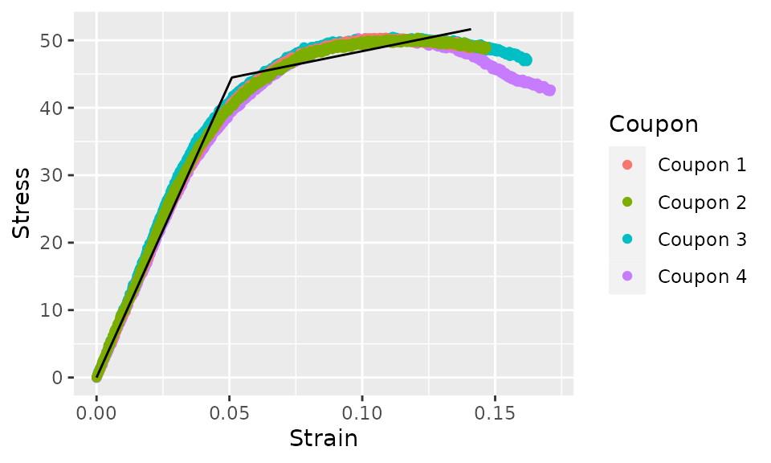

## Preprocessing Data

The example data in the `pa12_tension` data set is fairly well behaved
and does not need pre-processing. However, most data that you will
actually deal with will require pre-processing.

The `fff_shear` data set that comes with the `cmstatrExt` package is
more typical data that does require pre-processing. Let’s start by
plotting this data.

``` r
fff_shear %>%
  ggplot(aes(x = Strain, y = Stress, color = Specimen)) +
  geom_point()
```


There are three aspects of this data that we’ll deal with:

- The post-failure behavior at high strains will be removed. This part
  of the stress-strain curve is not important to most structural
  analysis and will make cure-fitting difficult.
- We’ll remove the “toe” at the start of the curves. (The “toe” is the
  small portion of the curves at low strain that have a relatively low
  slope). Depending on the test method, this “toe” can be caused by
  behavior like the test coupon seating itself in the test fixture, or
  clearance being taken up. Depending on the cause of the “toe,” it may
  be desirable to remove it. In this case, removing it is desirable.
- The curves, even with the “toe” removed, do no pass through the
  origin. This is due to an offset in the strain measurement that does
  not correspond to the physical behavior of the material, so we’ll
  apply an appropriate offset.

None of these adjustments are done using the functionality of
`cmstatrExt`, but this example is included anyways as these types of
adjustments are typically a pre-requisite of curve fitting using
`cmstatrExt`.

We’ll start by removing the offset from the data. To do this, we’ll fit
a straight line to the data from each coupon over a stress range of 1000
to 3000 `psi`, find the x-intercept of this line and subtract this
x-intercept from the strain value. This is a bit complicated, so we’ll
do it in a few steps before combining everything. We’ll start by
filtering the data so that the stress values are in the range 1000 to
3000, grouping by `Specimen` and finding the x-intercept for each. This
code will use the
[`nest()`](https://tidyr.tidyverse.org/reference/nest.html),
[`mutate()`](https://dplyr.tidyverse.org/reference/mutate.html)
[`map()`](https://purrr.tidyverse.org/reference/map.html) pattern.

``` r
fff_shear %>%
  filter(Stress > 1000 & Stress < 3000) %>%
  group_by(Specimen) %>%
  nest() %>%
  mutate(lm = map(data, ~lm(Strain ~ Stress, data = .))) %>%
  mutate(x_intercept = map(lm, ~predict(.x, data.frame(Stress = 0)))) %>%
  select(-c(lm, data)) %>%
  unnest(x_intercept)
#> # A tibble: 3 × 2
#> # Groups:   Specimen [3]
#>   Specimen x_intercept
#>   <chr>          <dbl>
#> 1 A          -0.000163
#> 2 B          -0.000117
#> 3 C          -0.000432
```

Now we’ll use
[`inner_join()`](https://dplyr.tidyverse.org/reference/mutate-joins.html)
to join the `x_intercept` column to the original data (matching the
appropriate `Specimen`). We’ll use
[`head()`](https://rdrr.io/r/utils/head.html) to just show the first 6
rows for brevity.

``` r
fff_shear %>%
  filter(Stress > 1000 & Stress < 3000) %>%
  group_by(Specimen) %>%
  nest() %>%
  mutate(lm = map(data, ~lm(Strain ~ Stress, data = .))) %>%
  mutate(x_intercept = map(lm, ~predict(.x, data.frame(Stress = 0)))) %>%
  select(-c(lm, data)) %>%
  unnest(x_intercept) %>%
  inner_join(fff_shear, by = "Specimen") %>%
  head(6)
#> # A tibble: 6 × 4
#> # Groups:   Specimen [1]
#>   Specimen x_intercept Stress   Strain
#>   <chr>          <dbl>  <dbl>    <dbl>
#> 1 A          -0.000163   230. 0       
#> 2 A          -0.000163   241. 0.000273
#> 3 A          -0.000163   240. 0.000426
#> 4 A          -0.000163   245. 0.000536
#> 5 A          -0.000163   246. 0.000597
#> 6 A          -0.000163   264. 0.000834
```

Finally, we’ll subtract the x-intercept from the strain for each coupon
to obtain the corrected data (and delete the unneeded `x_intercept`
column).

``` r
fff_shear_offset <- fff_shear %>%
  filter(Stress > 1000 & Stress < 3000) %>%
  group_by(Specimen) %>%
  nest() %>%
  mutate(lm = map(data, ~lm(Strain ~ Stress, data = .))) %>%
  mutate(x_intercept = map(lm, ~predict(.x, data.frame(Stress = 0)))) %>%
  select(-c(lm, data)) %>%
  unnest(x_intercept) %>%
  inner_join(fff_shear, by = "Specimen") %>%
  mutate(Strain = Strain - x_intercept) %>%
  select(-c(x_intercept))
```

We’ll plot this now.

``` r
fff_shear_offset %>%
  ggplot(aes(x = Strain, y = Stress, color = Specimen)) +
  geom_point()
```

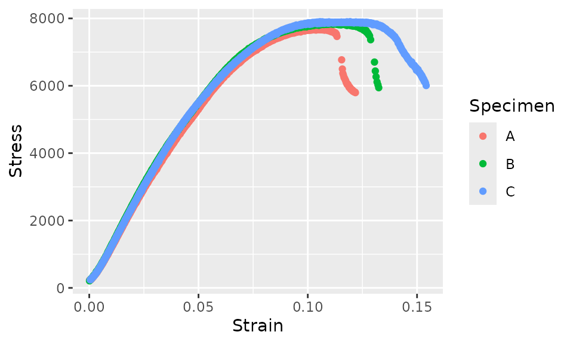

There are many approaches to removing the post-failure behavior. The
specific approach that should be used will depend on the data and test
method. In some cases, you might choose to simply manually delete some
rows from the data file. However, if you’re processing more data, you
may want to truncate the data using some code. Here, we’ll approach the
removal of the post-failure behavior by finding the data that has a
local slope that is sufficiently negative. We’ll do this by finding the
secant over 5 points and checking if this value is more negative than a
certain threshold. First, let’s plot the data and color it by a logical
value indicating whether we’ll remove the point. This will help find an
appropriate threshold using iteration for how negative a slope should
cause a point to be removed.

``` r
fff_shear_offset %>%
  group_by(Specimen) %>%
  mutate(Lead_Stress = lead(Stress, 5),
         Lead_Strain = lead(Strain, 5),
         Slope = (Lead_Stress - Stress) / (Lead_Strain - Strain),
         Remove = Slope < -1e5 | is.na(Slope)) %>%
  ggplot(aes(x = Strain, y = Stress, shape = Specimen, color = Remove)) +
  geom_point()
```

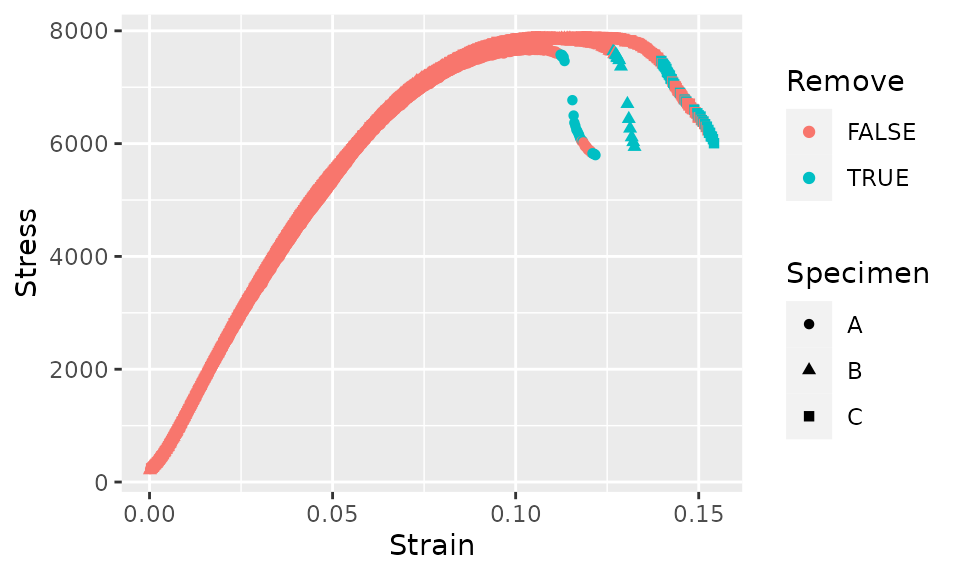

The criteria above seems to cut the data off at about the correct point,
but after the initial cutoff, some subsequent data would be incorrectly
retained. In order to avoid this, we’ll add another criteria that for
each curve, as soon as a single data point is removed, all subsequent
data points will also be removed.

``` r
fff_shear_offset %>%
  group_by(Specimen) %>%
  mutate(Lead_Stress = lead(Stress, 5),
         Lead_Strain = lead(Strain, 5),
         Slope = (Lead_Stress - Stress) / (Lead_Strain - Strain),
         Remove = Slope < -1e5 | is.na(Slope),
         Remove = cumsum(Remove) > 0) %>%
  ggplot(aes(x = Strain, y = Stress, shape = Specimen, color = Remove)) +
  geom_point()
```

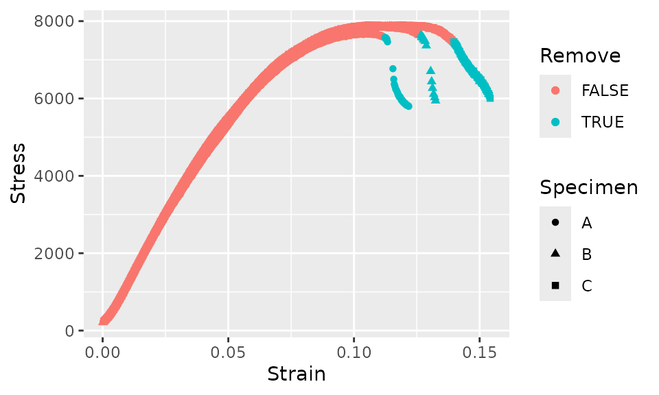

We’ll save this result to a new variable, remove the groupings, filter
out the points that we intend to remove and drop the unneeded temporary
variables.

``` r
fff_shear_truncated <- fff_shear_offset %>%
  group_by(Specimen) %>%
  mutate(Lead_Stress = lead(Stress, 5),
         Lead_Strain = lead(Strain, 5),
         Slope = (Lead_Stress - Stress) / (Lead_Strain - Strain),
         Remove = Slope < -1e5 | is.na(Slope),
         Remove = cumsum(Remove) > 0) %>%
  ungroup() %>%
  filter(!Remove) %>%
  select(Specimen, Stress, Strain)
```

Next, we’ll remove the “toe” of each curve. The “toe” extends to a
stress of somewhat less than 1000 `psi`, so we’ll remove the “toe” by
simply removing all the data with a stress less than 1000 `psi`.

``` r
fff_shear_truncated_no_toe <- fff_shear_truncated %>%
  filter(Stress > 1000)
```

Now, let’s plot this pre-processed data.

``` r
fff_shear_truncated_no_toe %>%
  ggplot(aes(x = Strain, y = Stress, color = Specimen)) +
  geom_point() +
  xlim(c(0, NA)) +
  ylim(c(0, NA))
```

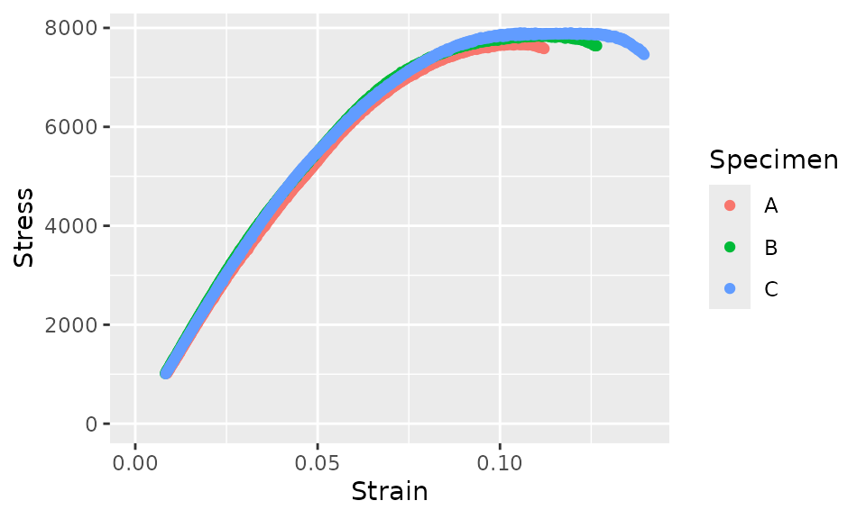

Now, let’s try fitting an averaged curve to this data.

``` r
curve_fff_shear <- fff_shear_truncated_no_toe %>%
  average_curve_lm(
    Specimen,
    Stress ~ I(Strain) + I(Strain^2) + I(Strain^3) + 0
  )
curve_fff_shear
#> 
#> Range: ` Strain ` in  [ 0,  0.112092 ]
#> 
#> Call:
#> average_curve_lm(data = ., coupon_var = Specimen, model = Stress ~ 
#>     I(Strain) + I(Strain^2) + I(Strain^3) + 0)
#> 
#> Coefficients:
#>   I(Strain)  I(Strain^2)  I(Strain^3)  
#>      129670      -312398     -2060929
```

And we’ll plot this curve fit overlaid on the data with only the strain
offset corrected (leaving the “toe” and the post-failure behavior
intact).

``` r
curve_fff_shear %>%
  augment(fff_shear) %>%
  ggplot(aes(x = Strain)) +
  geom_point(aes(y = Stress, color = Specimen)) +
  geom_line(aes(y = .fit))
```

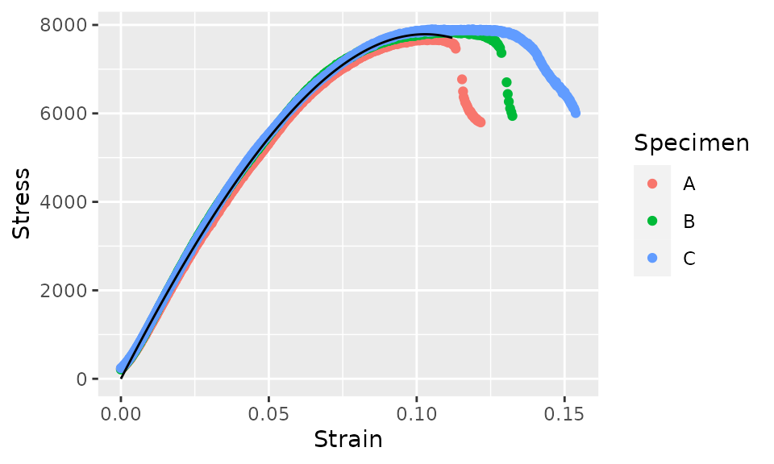

## Plots for Publication

The last part of this vignette will focus on creating plots for
publication in reports. We’ll focus on the following items as examples.
It will be up to you how you want to customize your plots for your
particular publication.

- Changing the theme
- Overlaying curves and data from multiple environmental conditions
- Adding a secondary y-axis to show both US Customary and SI units

The `cmstatrExt` package does not come with any data sets with multiple
environmental conditions. We’ll “fake it” for illustration purposes by
scaling the `pa12_tension` stress by 50% and strain by 125% to generate
data for the “Fake ETA” environmental condition. We’ll create a new data
frame by stacking the original `pa12_tension` data frame and a version
of the `pa12_tension` data frame with the stress scaled. Before stacking
these data frames, we’ll add a new column for condition.

``` r
pa12_tension_conditions <-
  bind_rows(
    pa12_tension %>%
      mutate(Condition = "RTA"),
    pa12_tension %>%
      mutate(Condition = "Fake ETA",
             Stress = 0.50 * Stress,
             Strain = 1.25 * Strain)
  )
```

We already have a cubic model for the original `pa12_tension` data, but
that model was missing the `Condition` column, so we’ll fit it again.

``` r
curve_cubic_rta <- pa12_tension_conditions %>%
  filter(Condition == "RTA") %>%
  average_curve_lm(
    Coupon,
    Stress ~ I(Strain) + I(Strain^2) + I(Strain^3) + 0
  )
curve_cubic_rta
#> 
#> Range: ` Strain ` in  [ 0,  0.1409409 ]
#> 
#> Call:
#> average_curve_lm(data = ., coupon_var = Coupon, model = Stress ~ 
#>     I(Strain) + I(Strain^2) + I(Strain^3) + 0)
#> 
#> Coefficients:
#>   I(Strain)  I(Strain^2)  I(Strain^3)  
#>        1173        -8762        20481
```

We’ll do the same for the “Fake ETA” data.

``` r
curve_cubic_fake_eta <- pa12_tension_conditions %>%
  filter(Condition == "Fake ETA") %>%
  average_curve_lm(
    Coupon,
    Stress ~ I(Strain) + I(Strain^2) + I(Strain^3) + 0
  )
curve_cubic_fake_eta
#> 
#> Range: ` Strain ` in  [ 0,  0.1761762 ]
#> 
#> Call:
#> average_curve_lm(data = ., coupon_var = Coupon, model = Stress ~ 
#>     I(Strain) + I(Strain^2) + I(Strain^3) + 0)
#> 
#> Coefficients:
#>   I(Strain)  I(Strain^2)  I(Strain^3)  
#>       469.3      -2803.8       5243.1
```

Now, we can plot the two curves.

``` r
bind_rows(
  augment(curve_cubic_rta),
  augment(curve_cubic_fake_eta)
) %>%
  ggplot(aes(x = Strain, y = .fit, color = Condition)) +
  geom_line()
```

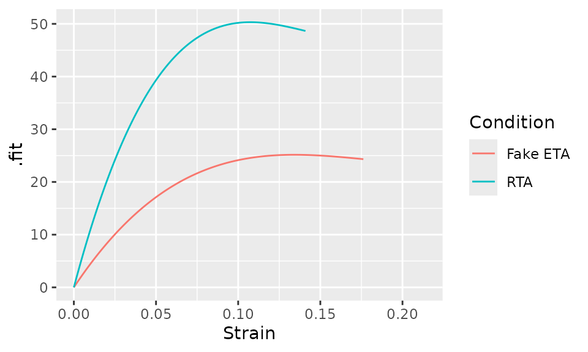

In some cases, you’d also want to show the raw data, which can be done
as follows. Note that we needed to set the `group` aestetic in the call
to
[`geom_line()`](https://ggplot2.tidyverse.org/reference/geom_path.html).

``` r
bind_rows(
  augment(curve_cubic_rta),
  augment(curve_cubic_fake_eta)
) %>%
  group_by(Condition) %>%
  ggplot(aes(x = Strain)) +
  geom_point(aes(y = Stress, color = Condition)) +
  geom_line(aes(y = .fit, group = Condition))
```

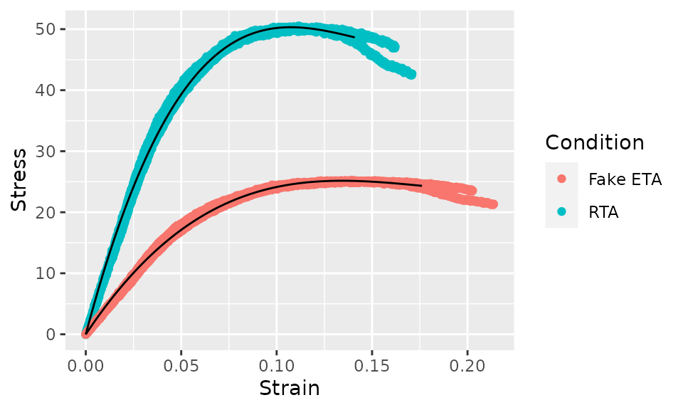

Next, we’ll add a secondary y-axis. Since the primary y-axis is in units
of `MPa`, the secondary y-axis will be in units of `ksi`. To do this,
we’ll use a call to
[`scale_y_continuous()`](https://ggplot2.tidyverse.org/reference/scale_continuous.html)

``` r
bind_rows(
  augment(curve_cubic_rta),
  augment(curve_cubic_fake_eta)
) %>%
  ggplot(aes(x = Strain, y = .fit, color = Condition)) +
  geom_line() +
  scale_y_continuous(
    "Stress [MPa]",
    sec.axis = sec_axis(~ . * 0.1450377377, name = "Stress [ksi]")
  )
```

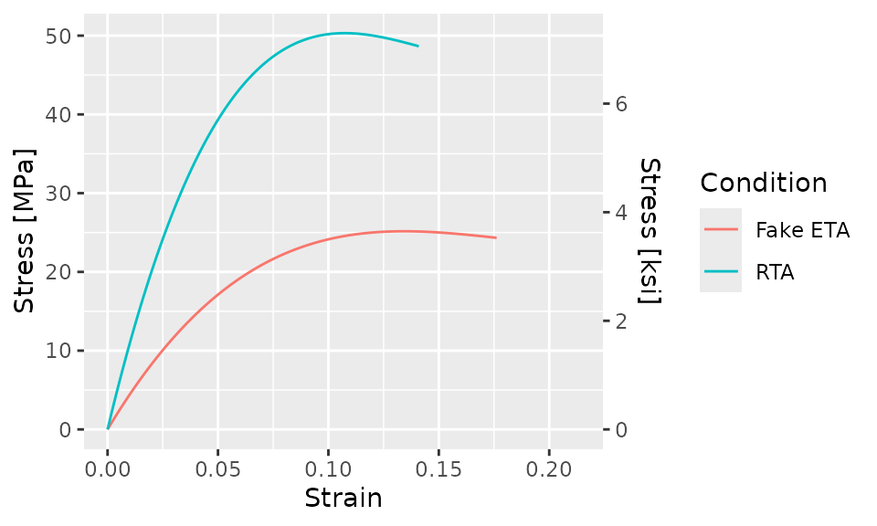

And it’s likely that you’d want to change the theme of the plot using,
for example,
[`theme_bw()`](https://ggplot2.tidyverse.org/reference/ggtheme.html) or
your own custom theme.

``` r
bind_rows(
  augment(curve_cubic_rta),
  augment(curve_cubic_fake_eta)
) %>%
  ggplot(aes(x = Strain, y = .fit, color = Condition)) +
  geom_line() +
  scale_y_continuous(
    "Stress [MPa]",
    sec.axis = sec_axis(~ . * 0.1450377377, name = "Stress [ksi]")
  ) +
  theme_bw()
```

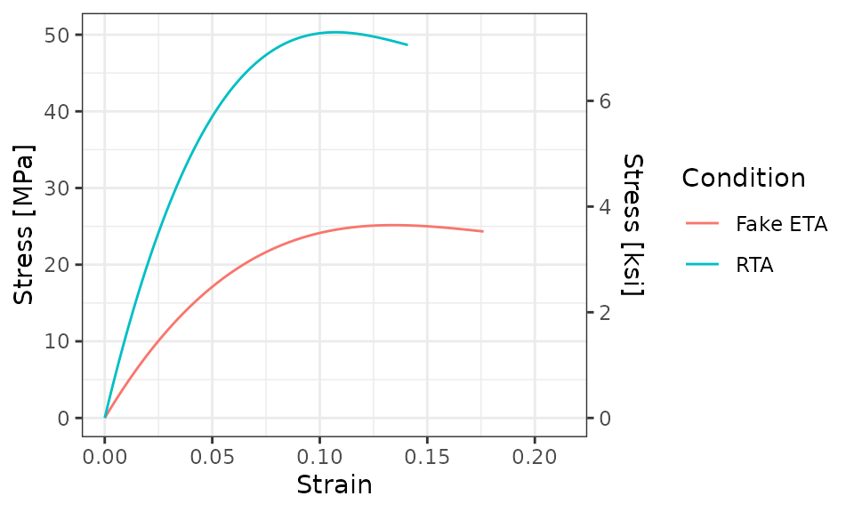
